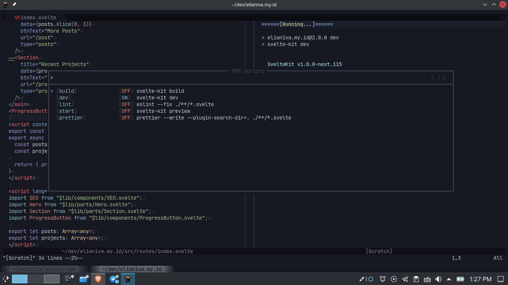

# telescope-npm.nvim

Telescope plugin for npm related things like running scripts or adding/removing packages.

<kbd></kbd>

## Running Scripts

The command is `:Telescope npm scripts`

<kbd>C-v</kbd> to open in vertical split
<kbd>C-x</kbd> to open in horizontal split
<kbd>CR</kbd> to open in new tab

## Installing / Uninstalling Packages

The command is `:Telescope npm scripts`

<kbd>C-i</kbd> to install
<kbd>C-d</kbd> to uninstall

Everything inside the prompt will be forwarded into `npm` cli so you can do `-D foo bar baz` to install dev dependencies.

## Configuration

> soon
